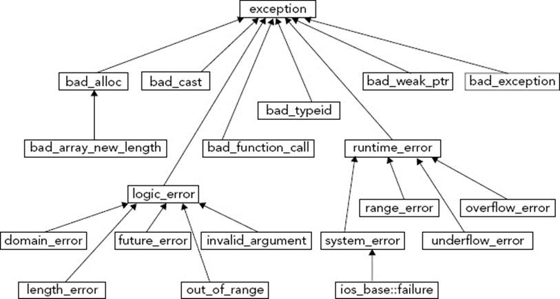
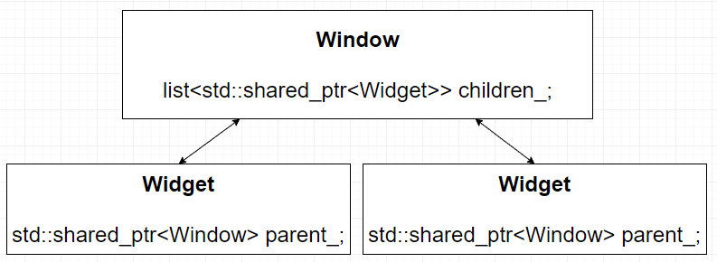

# Обработка ошибок

1. Возврат кода ошибки
2. Исключения

### Возврат кода ошибки

```c++
enum class Error
{
    Success,
    Failure
};

Error doSomething()
{
    return Error::Success;
}

if (doSomething() != Error::Success)
{
    showError();
}
```

\+ Простота

\- Ошибку можно проигнорировать

\- Сложности с инициализацией

```c++
auto data = readData("data.json");

Json data;
auto error = readData(data, "data.json");
```

### Исключения

\- Сложно

\+ Нельзя проигнорировать

```c++
class Error
{
};

void doSomething()
{
    throw Error();
}

try
{
    doSomething();
}
catch (const Error& error)
{
    showError();
}
```

#### Что такое исключительная ситуация?

Ошибка которую нельзя обработать на данном уровне и игнорирование которой делает дальнейшую работу программы бессмысленной.

#### Гарантии безопасности исключений (exception safety)

1. Гарантировано искючений нет (No-throw guarantee)

Операции всегда завершаются успешно, если исключительная ситуация возникла она обрабатывается внутри операции. Не достижимо.

2. Строгая гарантия (Strong exception safety)

Также известна как коммит ролбек семантика (commit or rollback semantics). Операции могут завершиться неудачей, но неудачные операции гарантированно не имеют побочных эффектов, поэтому все данные сохраняют свои исходные значения.

```c++
std::vector<int> source = ...;
try
{
    std::vector<int> tmp = source;
    tmp.push_back(getNumber());
    tmp.push_back(getNumber()); <-- Исключение
    tmp.push_back(getNumber());
    source.swap(tmp);
}
catch (...)
{
    return;
}
```

3. Базовая гарантия (Basic exception safety)

Выполнение неудачных операций может вызвать побочные эффекты, но все инварианты сохраняются и нет утечек ресурсов (включая утечку памяти). Любые сохраненные данные будут содержать допустимые значения, даже если они отличаются от того, что они были до исключения.

```c++
source.push_back(getNumber());
source.push_back(getNumber()); <-- Исключение
source.push_back(getNumber());
```

4. Никаких гарантий (No exception safety)

#### Поиск подходящего обработчика

```c++
class Error {};

class ArgumentError : public Error
{
    std::string message_;
public:
    ArgumentError(std::string&& message);
    const std::string getMessage() const;
};

File openFile(const std::string& name)
{
    if (name.empty())
        throw ArgumentError("empty file name");
}

try
{
    auto file = openFile("data.json");
    auto json = file.readAll();
}
catch (const ArgumentError& error)
{
    std::cerr << error.getMessage();
}
catch (const Error& error)
{
}
catch (...)
{
}
```

1. Поиск подходящего обработчика идет в порядке следования обработчиков в коде
2. Полного соответствия типа не требуется, будет выбран первый подходящий обработчик
3. Если перехватывать исключение по значению, то возможна срезка до базового класса
4. Если наиболее общий обработчик идет раньше, то более специализированный обработчик никогда не будет вызван
5. Три точки - перехват любого исключения

> Исключения ОС - не исключения С++, например, деление на ноль. Для их обработки нужно использовать средства предоставляемые конкретной платформой

### Стандартные классы рекомендуемые для исключений

```c++
#include <stdexcept>
```


#### Перезапуск исключения

```c++
try
{
    foo();
}
catch (...)
{
    std::cerr << "something wrong";
    throw;
}
```

#### noexcept

```c++
void foo() noexcept
{
}
```

noexcept говорит компилятору, что функция не выбрасывает исключений - это позволяет компилятору генерировать более производительный код, но если фактически исключение было выброшено, то будет вызвана функция terminate.

#### terminate

Вызывает стандартную функцию С - abort.

abort - аварийное завершение программы, деструкторы объектов вызваны не будут.

Поведение terimnate можно изменить установив свой обработчик функцией set_terminate.

#### Раскрутка стека

```c++
void foo()
{
    throw Error();
}

void bar()
{
    try
    {
        foo();
    }
    catch (const FileError&)
    {
    }
}

int main()
{
    try
    {
        bar();
    }
    catch (...)
    {
        std::cerr << "unknown error";
    }
    return 0;
}
```

Поиск подходящего обработчика вниз по стеку вызовов с вызовом деструкторов локальных объектов - раскрутка стека.

> Если подходящий обработчик не был найден вызывается стандартная функция terminate

#### Исключения в деструкторе

Исключение покинувшее деструктор во время раскрутки стека или у глобального/статического объекта приведет к вызову terminate.

Начиная с С++11 все деструкторы компилятором воспринимаются как помеченные noexcept - теперь исключения не должны покидать деструктора никогда.

#### Исключения в конструкторе

```c++
struct Socket
{
    static constexpr size_t BufferSize = 2048;
    
    Socket(const std::string& address)
    	: data_(new char[BufferSize])
    {
        if (address.empty())
            throw ArgumentError();
    }
    
    ~Socket()
    {
        delete[] buffer_;
    }
    
    char* buffer_;
};
```

Для полностью сконструированных на момент выброса исключения объектов будут вызваны деструкторы, память выделенная под объект будет корректно освобождена, но поскольку объект не был полностью сконструирован, то деструктор вызван не будет.

#### Управление ресурсами

Используем идеому RAII (Resource Acquire Is Initialization):

```c++
struct Buffer
{
    Buffer(size_t size)
    	: data_(new char[size])
    {
    }
    
    ~Buffer()
    {
        delete[] data_;
    }
    
    char* data_;
};
```
```c++
struct Socket
{
    static constexpr size_t BufferSize = 2048;
    
    Socket(const std::string& address)
    	: buffer_(BufferSize)
    {
        if (address.empty())
            throw ArgumentError();
    }
    
    Buffer buffer_;
};
```

### Управление памятью

Стандартная библиотека предлагает два умных указателя для автоматического управления памятью:
1. unique_ptr
2. shared_ptr / weak_ptr

#### unique_ptr

- Монопольное владение памятью, в конструкторе захват, в деструкторе освобождение
- Копирование запрещено, перемещение разрешено

```c++
std::unique_ptr<MyClass> x(new MyClass());
std::unique_ptr<char[]> x(new char[1024]);
auto y = std::make_unique<MyClass>(); // C++14
```

#### shared_ptr

- Совместное владение памятью
- Копирование увеличивает счетчик ссылок
- В деструкторе счетчик уменьшается и если становиться равным 0, то объект уничтожается

```c++
std::shared_ptr<MyClass> x(new MyClass());
auto y = std::make_shared<MyClass>();
```

#### Точки следования (sequence points)

Точки следования - это точки в программе, где состояние реальной программы полностью соответствует состоянию следуемого из исходного кода.

Точки следования необходимы для того, чтобы компилятор мог делать оптимизацию кода.

```c++
// Может быть утечка
foo(std::shared_ptr<MyClass>(new MyClass()), bar());
```
```c++
std::shared_ptr<MyClass> x(new MyClass());
foo(x, bar()); // ok
```
```c++
foo(std::make_shared<MyClass>(), bar()); // ok
```

Местонахождение точек:

1. В конце каждого полного выражения - ;
2. В точке вызова функции после вычисления всех аргументов
3. Сразу после возврата функции, перед тем как любой другой код из вызвавшей функции начал выполняться
4. После первого выражения (а) в следующих конструкциях:
```c++
	a || b 
	a && b
	a, b
	a ? b : c
```

Если программа пытается модифицировать одну переменную дважды не пересекая точку следования, то это ведет к неопределенному поведению (undefined behavior):

```c++
int x = 0;
x = x++; // <-- UB

int i = 0;
i = i++ + ++i; // <-- UB
```

#### Схематичное устройство shared_ptr

```c++
#include <cassert>
#include <iostream>

template <class T>
class SharedPtr
{
    struct Data
    {
        T* object_;
        int counter_;
    };

    Data* data_;

public:
    SharedPtr(T* object = nullptr)
        : data_(new Data{ object, 1 })
    {
    }

    ~SharedPtr()
    {
        --data_->counter_;
        if (data_->counter_ == 0)
        {
            delete data_->object_;
            delete data_;
        }
    }

    SharedPtr(const SharedPtr<T>& copied)
    {
        if (this == &copied)
            return;

        data_ = copied.data_;
        ++data_->counter_;
    }

    SharedPtr& operator=(const SharedPtr<T>& copied)
    {
        if (this == &copied)
            return *this;

        --data_->counter_;
        data_ = copied.data_;
        ++data_->counter_;
        return *this;
    }

    T& operator*()
    {
        return *data_->object_;
    }

    const T& operator*() const
    {
        return *data_->object_;
    }

    T* operator->()
    {
        return data_->object_;
    }

    const T* operator->() const
    {
        return data_->object_;
    }
};

struct A
{
    A() { std::cout << "A" << std::endl; }
    ~A() { std::cout << "~A" << std::endl; }
    void foo() { std::cout << this << std::endl; }
};

SharedPtr<A> foo(SharedPtr<A> x)
{
    return x;
}

int main()
{
    auto x = foo(new A());
    auto y = x;
    y->foo();
    (*x).foo();
    y = nullptr;
    return 0;
}
```

##### Предпочитайте make_shared

```c++
auto x = std::shared_ptr<MyClass>(new MyClass());
auto x = std::make_shared<MyClass>();
```

1. Нет дублирования (MyClass два раза)
2. Безопасно в вызове функций
3. Оптимально - 1 вызов new вместо 2

### Проблема циклических ссылок



```c++
class Widget;

class Window
{
    std::vector<std::shared_ptr<Widget>> children_;
};

class Widget
{
    std::shared_ptr<Window> parent_;
};
```

Winwow не может быть удален, так как в Widget жив shared_ptr на него, а Widget в свою очередь не может быть удален, так как жив Window.

> Ключевой вопрос С++ - кто кем владеет

#### weak_ptr

```c++
class Widget;

class Window
{
    std::vector<std::shared_ptr<Widget>> children_;
};

class Widget
{
    std::weak_ptr<Window> parent_;
};
```

weak_ptr не принимает владение объектом, но располагая weak_ptr всегда можно узнать жив ли объект и если жив, то получить на него shared_ptr.

```c++
std::shared_ptr<A> x;
std::weak_ptr<A> weak = x;
std::shared_ptr<A> y = weak.lock();
if (y)
{
    ...
}
```

#### enable_shared_from_this

Иногда нужно получить shared_ptr от самого себя, например, очень актуально при асинхронном взаимодействии, когда время жизни объекта не определено.

```c++
class A
{
    std::shared_ptr<A> getSharedPtr()
    {
        // Приведет к многократному удалению
        return std::shared_ptr<A>(this);
    }
};
```
```c++
class A
    : public std::enable_shared_from_this<A>
{
    std::shared_ptr<A> getSharedPtr()
    {
        return shared_from_this(); // Ok
    }
};
```

##### Ограничения enable_shared_from_this

```c++
class A
    : public std::enable_shared_from_this<A>
{
    A()
    {
        shared_from_this(); // throw std::bad_weak_ptr
    }

    ~A()
    {
        shared_from_this(); // throw std::bad_weak_ptr
    }
};
```

### Практическая часть

Нужно переделать калькулятор из предыдущего занятия, а конкретней - добавить обработку ошибок с помощью исключений. Если где-то выделялась память в куче, переделать с использованием умных указателей. Отныне если в коде будет замечен delete/free, то будет снят 1 бал.

EOF